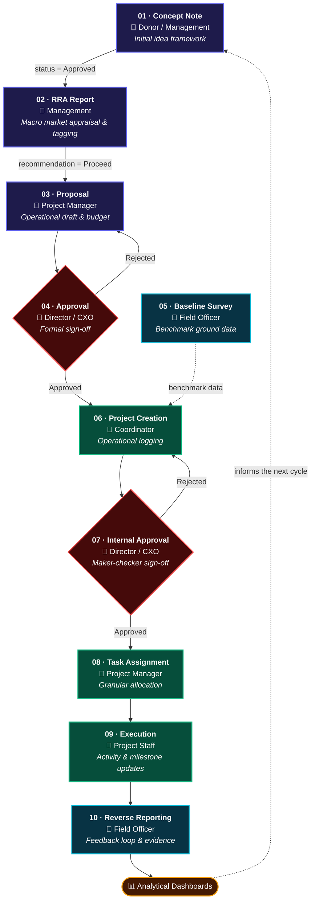
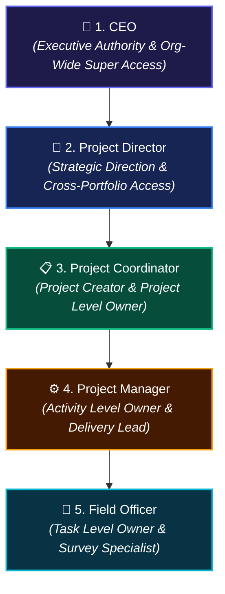
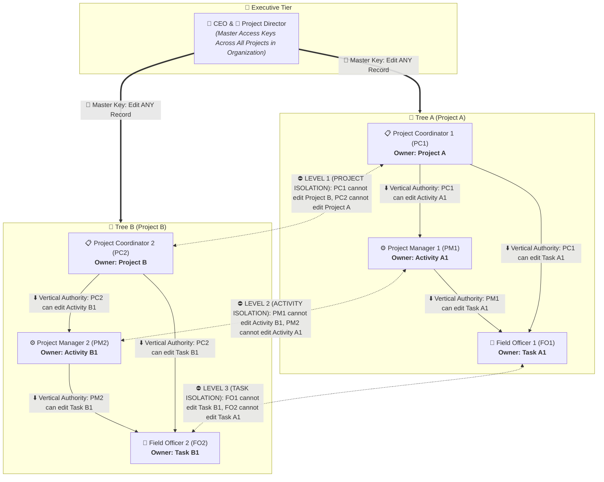
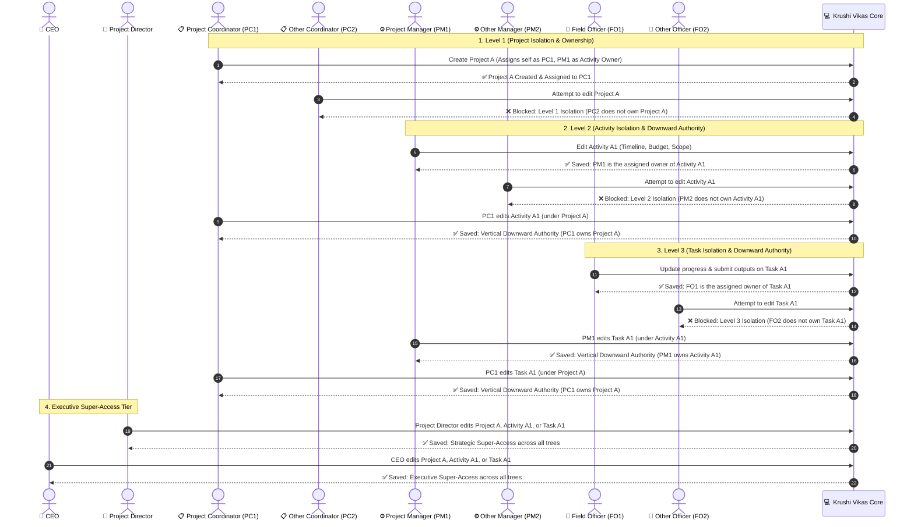

# 🗺️ Krushi Vikas — Full User Journey

## Part A — End-to-End Operational Roadmap (10 Steps)

An idea becomes a funded, staffed, reporting project through ten steps.
Each hand-off is enforced in code: a step cannot start until the one before
it has closed cleanly, so the chain cannot be short-circuited from the UI.



### Where each step lives

| # | Step | Owner | DocType | Gate |
|---|---|---|---|---|
| 01 | Concept Note | Donor / Management | `Concept Note` | *Concept Note Approval* workflow |
| 02 | RRA Report | Management | `RRA Report` | *RRA Report Approval* workflow |
| 03 | Proposal | Project Manager | `Project Proposal` | — |
| 04 | Approval | Director / CXO | `Project Proposal` | *Project Proposal Approval* → `Approved` |
| 05 | Baseline Survey | Field Officer | `Baseline Survey` | — |
| 06 | Project Creation | Coordinator | `KV Project` | requires an approved proposal |
| 07 | Internal Approval | Director / CXO | `KV Project` | *KV Project Internal Approval* workflow |
| 08 | Task Assignment | Project Manager | `Activity` / `Task` | — |
| 09 | Execution | Project Staff | `Task`, project status | — |
| 10 | Reverse Reporting | Field Officer | `Activity Outcome`, `Feedback Survey` | — |

### Phase matrix

| Phase | Steps | What happens |
|---|---|---|
| **1 · Planning & Conception** | 01 – 02 | Donor alignment and macro appraisal. Held as reference data; nothing operational exists yet. |
| **2 · Formalization & Baseline** | 03 – 05 | Maker-checker on the proposal, and field collection of baseline impact metrics. |
| **3 · System Ingestion & Control** | 06 – 08 | The Coordinator creates the project, leadership validates it, the Manager allocates work. |
| **4 · Field Actions & Evaluation** | 09 – 10 | Execution tracking, with reverse reporting funnelling evidence to the dashboards. |

### The hand-offs, in code

Each is whitelisted in `krushi_vikas/api.py` and refuses to run out of order:

```
create_rra_from_concept_note(concept_note)      # 02 <- 01, needs status Approved
create_proposal_from_rra(rra_report)            # 03 <- 02, needs recommendation Proceed
create_project_from_proposal(proposal, coord)   # 06 <- 04, needs workflow_state Approved
get_journey_status(project)                     # roadmap read-out for one project
```

`create_project_from_proposal` carries the agreed budget, dates, theme and
manager onto the project rather than asking anyone to re-key them, so a
project cannot disagree with what leadership signed off. The project keeps
links back to its proposal, appraisal and concept note.

### Journey stage on the project

`KV Project.journey_stage` is **derived on every save**, never typed. It reads
the project's own state, so it cannot drift:

| Condition | Stage |
|---|---|
| status Completed or Cancelled | `Closed` |
| approval pending or rejected | `07 Internal Approval` |
| an Activity Outcome or Feedback Survey exists | `10 Reverse Reporting` |
| status In Progress / Deployed | `09 Execution` |
| approved, or activities exist | `08 Task Assignment` |
| otherwise | `06 Project Created` |

The stage always names *what happens next*, so it advances monotonically.

### Verifying

```bash
bench --site <site> execute krushi_vikas.test_journey.run
```

Walks a concept note through to field evidence and asserts every gate holds —
26 checks, all rolled back afterwards.

---

## Part B — Role Hierarchy & Lateral Isolation


This document details the **Role Hierarchy**, **Complete 3-Level Lateral Isolation**, **Vertical Downward Update Authority**, and **Step-by-Step User Journeys** with respect to **Projects**, **Activities**, and **Tasks** in the Krushi Vikas system.

---

## 🏛️ 1. Role Hierarchy (5-Tier Rank)



---

## 🔒 2. Multi-Tier Hierarchy & 3-Level Lateral Isolation



---

## 📋 3. Update Rights Summary Matrix

| Role | Edit Project | Edit Activity | Edit Task | Edit Survey |
| :--- | :--- | :--- | :--- | :--- |
| **👑 1. CEO** | ✅ **ANY** Project across organization | ✅ **ANY** Activity across organization | ✅ **ANY** Task across organization | ✅ **ANY** Survey |
| **🌟 2. Project Director** | ✅ **ANY** Project across organization | ✅ **ANY** Activity across organization | ✅ **ANY** Task across organization | ✅ **ANY** Survey |
| **📋 3. Project Coordinator** | ✅ **ONLY** projects owned by him<br>⛔ *Peer Coordinators blocked* | ✅ **ANY** Activity in his project<br>⛔ *Activities in other projects blocked* | ✅ **ANY** Task in his project<br>⛔ *Tasks in other projects blocked* | ✅ Surveys in his project |
| **⚙️ 4. Project Manager** | ❌ Read-Only on Projects | ✅ **ONLY** activities assigned to him<br>⛔ *Peer Managers blocked* | ✅ **ANY** Task in his assigned activity<br>⛔ *Tasks in other activities blocked* | ✅ Surveys in his activity |
| **🌱 5. Field Officer** | ❌ Read-Only on Projects | ❌ Read-Only on Activities | ✅ **ONLY** tasks assigned to him<br>⛔ *Peer Officers blocked* | ✅ **ONLY** surveys filed by him |

---

## 🗺️ 4. Multi-Tier End-to-End User Journey



---

## 👤 5. Detailed Breakdown by Role

### 👑 1. CEO (Executive Tier)
- **Scope**: Organization-wide unrestricted access.
- **Update Capabilities**: Can create, view, modify, approve, or delete **any** Project, Activity, Task, or Survey without needing to be in that specific project's ownership chain.

### 🌟 2. Project Director (Strategic Governance Tier)
- **Scope**: Cross-portfolio strategic leadership.
- **Update Capabilities**: Can create, modify, and manage **any** Project, Activity, Task, or Survey across all thematic areas and coordinators.

### 📋 3. Project Coordinator (Project Owner Tier)
- **Scope**: Project-level ownership.
- **Update Capabilities**:
  - **Project**: Can edit **only** projects assigned to them (`project_coordinator == session.user`). Peer coordinators (`PC2`) are strictly blocked (**Level 1 Isolation**).
  - **Activity**: Can edit **any** Activity belonging to their owned project (`Activity A1`).
  - **Task**: Can edit **any** Task belonging to their owned project (`Task A1`).

### ⚙️ 4. Project Manager (Activity Delivery Tier)
- **Scope**: Activity-level ownership and delivery.
- **Update Capabilities**:
  - **Project**: Read-only access.
  - **Activity**: Can edit **only** activities assigned to them (`assignee == session.user`). Peer managers (`PM2`) are strictly blocked (**Level 2 Isolation**).
  - **Task**: Can edit **any** Task belonging to their assigned activity (`Task A1`).

### 🌱 5. Field Officer (Field Data & Task Execution Tier)
- **Scope**: Task-level frontline execution.
- **Update Capabilities**:
  - **Project & Activity**: Read-only context.
  - **Task**: Can edit **only** tasks assigned directly to them (`custom_activity_owner == session.user`). Peer officers (`FO2`) are strictly blocked (**Level 3 Isolation**).
  - **Surveys**: Can create and edit surveys and activity outcomes submitted by them.
