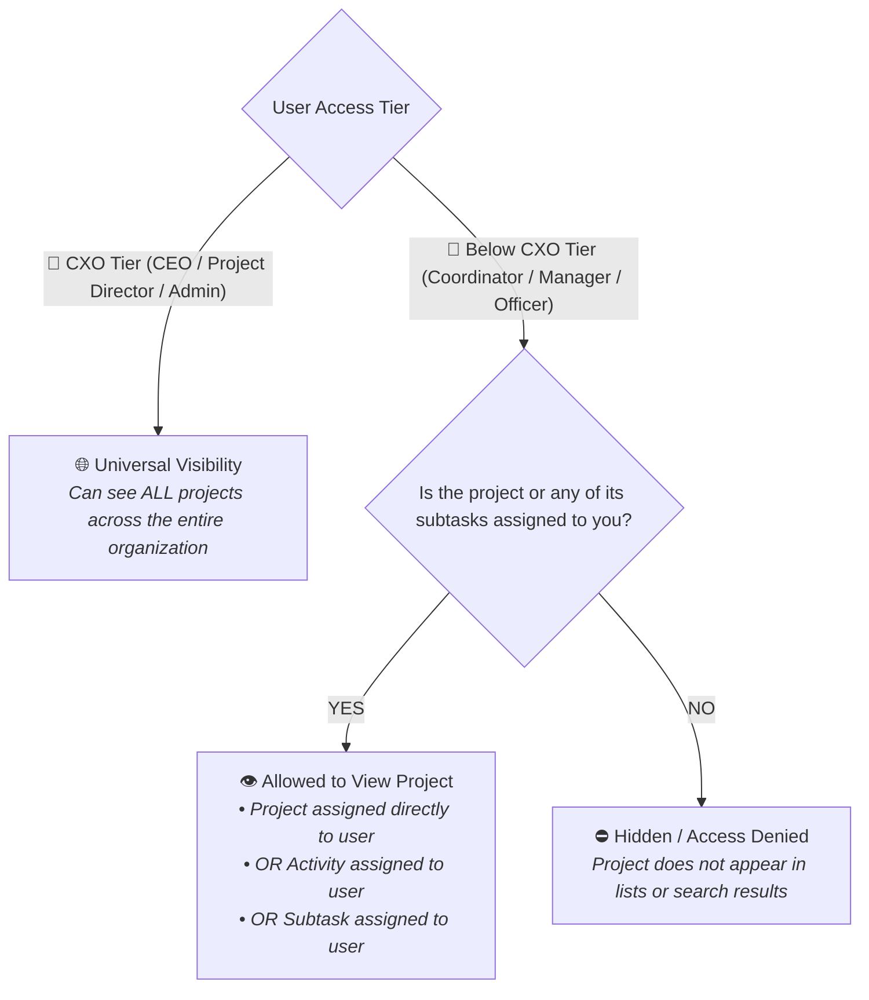
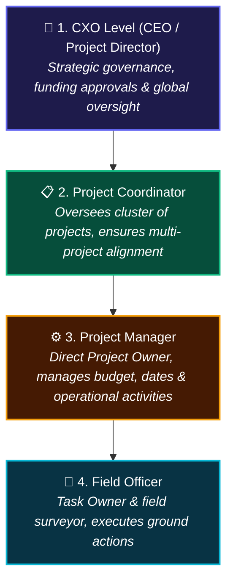

# 🚜 Krushi Vikas - Project Flow User Journey

This document defines the **Project Flow** across all user tiers in the Krushi Vikas platform. It outlines the step-by-step journey of creating, configuring, executing, and monitoring projects, including what each user sees and does on every page.

---

## 🔒 1. Visibility & Access Rules (Below CXO Level)

To maintain strict operational focus and data isolation, project visibility is governed by the following rule:



### Visibility Summary by Role:
* **👑 CXO Level (CEO, Project Director, System Manager, Administrator)**:
  * Universal cross-organization visibility. Sees all projects across all coordinators, managers, and regions.
* **📋 Project Coordinator**:
  * Sees **only** projects assigned to them under their oversight (`project_coordinator == session.user`) or projects where a subtask is assigned to them. Peer coordinators' unrelated projects are hidden.
* **⚙️ Project Manager**:
  * Sees **only** the project assigned to them (`project_manager == session.user`) or projects where an activity/subtask is assigned to them. Peer managers' unrelated projects are hidden.
* **🌱 Field Officer**:
  * Sees **only** projects that have an activity or subtask assigned to them (`custom_activity_owner == session.user` / linked Employee ID or `assignee == session.user`). Unrelated projects are completely hidden.

---

## 👥 2. Role Responsibilities in the Project Flow



---

## 🗺️ 3. End-to-End Project Flow Lifecycle

```mermaid
sequenceDiagram
    autonumber
    actor PC as 📋 Project Coordinator
    actor PM as ⚙️ Project Manager
    actor FO as 🌱 Field Officer
    participant Sys as 💻 Krushi Vikas Core

    Note over PC,PM: Step 1: Project Initiation & Role Assignment
    alt Created by Project Coordinator
        PC->>Sys: Create Project (Assigns self as Coordinator, assigns PM as Owner)
    else Created by Project Manager
        PM->>Sys: Create Project (Assigns self as PM, selects supervising Coordinator)
    end
    Sys-->>Sys: Enforce both Coordinator & Manager fields; apply visibility rules

    Note over PM,Sys: Step 2: Project Breakdown into Activities
    PM->>Sys: Open Project -> Add Activities & Set Activity Budgets/Dates
    Sys-->>PM: Auto-calculate remaining funds (Budget - Actuals)

    Note over PM,FO: Step 3: Task Delegation to Field Officers
    PM->>Sys: Create Tasks under Activity -> Assign to Field Officer (FO)
    Sys-->>FO: Task appears on Field Officer's worklist & project becomes visible to FO

    Note over FO,Sys: Step 4: Ground Execution & Survey Data
    FO->>Sys: Execute task, update status to Completed, submit Baseline/Feedback surveys
    Sys-->>PM: Milestone completion & KRE updates reflect on Project
```

---

## 📄 4. Screen-by-Screen Project Journey

### Screen 1: Project Initiation (`Create Project` Action)
* **Where users start:** Top action bar / Project List / Overview.
* **Who sees the button:**
  * **CXO (CEO / Director / Admin)**: Yes.
  * **Project Coordinator**: Yes.
  * **Project Manager**: Yes.
  * **Field Officer**: No (creation button hidden; creation attempts blocked by permissions).

> 📸 **[SCREENSHOT PLACEHOLDER 1: Create Project Action Button]**  
> *Attach screenshot showing the `+ Create Project` button in the top action bar on the Project List / Overview page for an authorized user (Project Coordinator or Manager).*

---

### Screen 2: Project Creation Form
**Page Route:** `/app/kv-project/new-kv-project` (or Web Portal `/project_form`)

#### Key Fields Maintained:
1. **Core Parameters**:
   * **Project Name**: Unique descriptive title (e.g., *"Dryland Watershed & Micro-Irrigation Initiative 2026"*).
   * **Thematic Area (`Theme`)**: Linked to Project Theme hierarchy (e.g., *Water Harvesting*, *Organic Farming*).
   * **Project Phase**: Select dropdown (*Planning*, *Proposal*, *Execution*, *Results*, *Feedback*, *Future*).
   * **Status**: Execution status (*Planning*, *In Progress*, *Deployed*, *Completed*, *Cancelled*).
2. **Mandatory Project-Level Roles**:
   * **`Project Coordinator`** (Required): Overseeing lead responsible for multi-project alignment.
   * **`Project Manager`** (Required): Assigned project owner and operational delivery lead.
3. **Timeline & Financials**:
   * **Start Date** & **End Date**.
   * **Budget (INR)**: Total sanctioned funds.

#### What Users Do:
* The creator (Coordinator or Manager) fills in the project parameters, selects the partner in charge (Coordinator/Manager), enters the initial budget, and clicks **Save**.

> 📸 **[SCREENSHOT PLACEHOLDER 2: Project Creation Form]**  
> *Attach screenshot of the Project Creation Form highlighting the mandatory Project Coordinator and Project Manager link fields, timeline dates, and initial budget configuration.*

---

### Screen 3: Project List View (Visibility-Filtered)
**Page Route:** `/app/kv-project`

#### What Each User Sees in the List:
* **👑 CXO Level**: Complete directory of all projects in the system.
* **📋 Project Coordinator**: Only projects where they are assigned as Coordinator (`project_coordinator == user`) or where they have a subtask.
* **⚙️ Project Manager**: Only projects where they are assigned as Manager (`project_manager == user`) or where they have a subtask.
* **🌱 Field Officer**: Only projects that have activities or subtasks assigned to them. Unrelated projects do not appear in list or search.

> 📸 **[SCREENSHOT PLACEHOLDER 3: Project List View with Filtered Visibility]**  
> *Attach screenshot of the `/app/kv-project` List View showing only projects assigned to the logged-in user or containing their assigned subtasks.*

---

### Screen 4: Project Detail & Form View
**Page Route:** `/app/kv-project/{project_name}`

#### What Each User Sees & Does:
* **⚙️ Project Manager (Project Owner)**:
  * Full edit authority over this project.
  * Inputs **Actual Amount Spent**; the system dynamically calculates **Remaining Funds** (`Budget - Actual Amount Spent`).
  * Manages the embedded **Activities child table**.
  * Advances the project phase (*Planning* ➔ *Execution* ➔ *Results*).
* **📋 Project Coordinator (Supervising In-Charge)**:
  * Full edit authority over all projects under their supervision.
  * Validates budget utilization and strategic milestones.
  * Accesses quick action buttons in header: **`View Activities`**, **`View Tasks`**, and **`Linked Forms`** (*Baseline Survey*, *Field Tracking Form*).
  * If opening a peer coordinator's project, the document opens in **Read-Only** mode.
* **🌱 Field Officer**:
  * Opens the project in **Read-Only** mode.
  * Reviews the background objectives, target beneficiary counts, and project scope.

> 📸 **[SCREENSHOT PLACEHOLDER 4: Project Form - Financial Tracking & Activities Table]**  
> *Attach screenshot of an active KV Project form showing the Financial Tracking section (Budget, Actual Spent, Remaining Funds), Coordinator & Manager assignments, and the child activity table.*

---

### Screen 5: Activities Setup under Project
**Page Route:** `/app/activity` (or Project Activities Child Table)

> *Note: Detailed descriptions of individual activities will be elaborated by the activity lead teammate.*

#### Mention of Core Project Activities:
1. **Baseline Household Survey & Village Profiling**
2. **Soil Health Assessment & Soil Testing Camps**
3. **Continuous Contour Trenching (CCT) & Watershed Bunding**
4. **Kitchen Garden Demonstration & Seed Kit Distribution**
5. **Drip & Micro-Irrigation Technical Training**
6. **Self-Help Group (SHG) Capacity Building & Farmer Field Schools**
7. **Organic Fertilizer (Vermi-compost) Preparation & Distribution**
8. **Post-Harvest Handling & Market Linkage Workshops**
9. **Activity Outcome Verification & KRE Measurement**

#### What Users Do on This Screen:
* **Project Manager**: Assigns activity delivery leads (`assignee`), sets planned budgets, and inputs activity start/end dates (which automatically inherit to subtasks). Clicks **`New Task under this Activity`** to delegate work.
* **Project Coordinator**: Holds downward vertical authority to inspect and edit any activity under their overseen projects.
* **Field Officer**: Read-only view; clicks **`View Tasks`** to inspect their specific work items.

> 📸 **[SCREENSHOT PLACEHOLDER 5: Activity Breakdown & Allocation]**  
> *Attach screenshot of an Activity record showing the linked KV Project, Assignee, Planned Budget, timeline dates, and the 'New Task under this Activity' action button.*

---

### Screen 6: Task Execution & Ground Operations
**Page Route:** `/app/task` (or Web Portal `/tasks`)

#### What Each User Sees & Does:
* **🌱 Field Officer (Task Owner)**:
  * Frontline owner of tasks assigned directly to them (`custom_activity_owner == session.user`).
  * Follows field instructions, checklists, and dependency conditions.
  * Updates task lifecycle status from `Open` ➔ `Working` ➔ `Completed`.
  * Cannot edit tasks assigned to peer officers (**Task Lateral Isolation**).
* **⚙️ Project Manager**:
  * Oversees tasks across all activities in their project, verifies outputs, and signs off on milestones.
* **📋 Project Coordinator**:
  * Tracks high-level task completion across their overseen projects.

> 📸 **[SCREENSHOT PLACEHOLDER 6: Task Execution Form]**  
> *Attach screenshot of a Task record displaying the Subject, Assigned Field Officer, Parent Activity, Project link, and Status dropdown.*

---

### Screen 7: Survey & Outcome Linking
**Page Routes:**
* Baseline Survey: `/app/baseline-survey` (or `/village_profile`)
* Feedback Survey: `/app/feedback-survey` (or `/feedback_survey`)

#### What Users Do:
* **Field Officer**: Submits frontline farmer survey data (household income, landholding, adoption rates 0-100%, and farmer feedback).
* **Sync to Project**: Approved feedback surveys automatically link to the parent project and push actual measurements to Key Result Expectations (KREs).
* **Project Manager & Coordinator**: View linked survey outcomes directly on the project form to measure real-world impact.

> 📸 **[SCREENSHOT PLACEHOLDER 7: Linked Survey Submission Form]**  
> *Attach screenshot of a survey submission form showing farmer details, project link, adoption percentage, and impact metrics.*

---

## 📊 5. Summary Table: User Capabilities Across Project Screens

| Screen / Page | 👑 CXO Tier | 📋 Project Coordinator | ⚙️ Project Manager | 🌱 Field Officer |
| :--- | :--- | :--- | :--- | :--- |
| **`+ Create Project` Action** | ✅ Enabled | ✅ Enabled | ✅ Enabled | ⛔ Hidden |
| **Project Creation Form** | Create any project; assign Coordinator & Manager | Create project; assign self as Coordinator & select PM | Create project; assign self as PM & select Coordinator | ⛔ Access Denied |
| **Project List View** | All organization projects visible | Only overseen projects or projects with subtasks | Only assigned projects or projects with subtasks | Only projects with assigned subtasks/activities |
| **Project Detail Form** | Full Edit & Delete on all projects | Edit all projects under their oversight (Peer read-only) | Edit assigned project; track budget & remaining funds | 👁️ Read-Only access |
| **Activities Setup** | Edit/Delete any activity across org | Edit any activity in projects under their oversight | Own & edit assigned activities; delegate tasks | 👁️ Read-Only; click 'View Tasks' |
| **Task Execution** | Full Edit on any task | Edit any task in projects under their oversight | Edit & review any task in their assigned activities | Own & edit assigned tasks; mark Completed |
| **Survey Linking** | View all survey analytics across org | Review surveys in overseen projects | Review surveys in assigned project; track adoption | Create & submit surveys during field visits |

---

## 📌 Teammate Instructions for Screenshots
1. **Directory**: Place all captured images in `docs/screenshots/`.
2. **Naming Convention**: `screenshot_1_create_project_button.png`, `screenshot_2_project_creation_form.png`, etc.
3. **Replacement**: Replace each `📸 [SCREENSHOT PLACEHOLDER #]` tag with standard markdown image links:  
   ``
