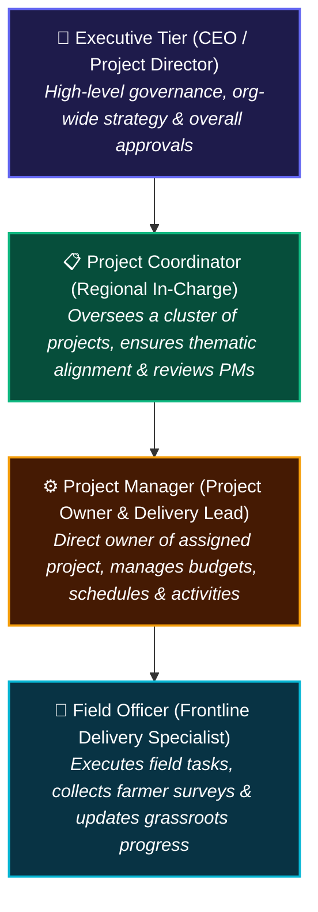
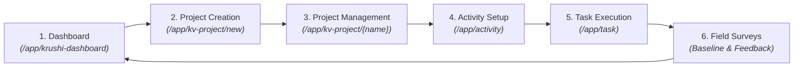

# 🚜 Krushi Vikas - Project Flow User Journey

This document outlines the **End-to-End Project Flow** across all user tiers in the Krushi Vikas system. It specifies **what each user role sees and does on every screen/page** throughout the project lifecycle.

---

## 👥 User Roles & Responsibilities in the Project Flow

* **Project Coordinator**: In charge of regional execution; oversees multiple projects assigned under them.
* **Project Manager**: Directly owns their assigned project, breaking it down into operational activities and tracking delivery.
* **Field Officer**: Frontline executor assigned to specific tasks, farmer engagements, and survey data collection.
* **Executive (CEO / Project Director / Admin)**: Super-access across all projects, portfolios, and reports.

---

## 🗺️ Project Lifecycle Navigation Map

---

## 📄 Screen-by-Screen User Journey

### Phase 1: Overview & Initiation (Dashboard)
**Page Route:** `/app/krushi-dashboard`

#### What Each User Sees:
* **👑 Executive (CEO / Director / Admin)**:
  * Sees organization-wide aggregate metrics: Total Projects, Active Projects, Planned Projects, Completed Projects.
  * Interactive **Annual Project Plan (Gantt chart)** displaying all projects across all coordinators and managers throughout the selected year.
  * Portfolio breakdown and quick access to all recent projects.
  * Active **`+ Create Project`** button in the header.
* **📋 Project Coordinator**:
  * Metrics and Gantt charts filtered strictly to **projects under their oversight** (`project_coordinator == session.user`).
  * Real-time visibility into whether the Project Managers in their cluster are on track.
  * Active **`+ Create Project`** button.
* **⚙️ Project Manager**:
  * Metrics and Gantt charts filtered strictly to **projects assigned to them** (`project_manager == session.user`).
  * Direct view of their current execution status and timeline milestones.
  * Active **`+ Create Project`** button.
* **🌱 Field Officer**:
  * Filtered view showing only projects where they have assigned activities/tasks.
  * `+ Create Project` button is hidden.

#### What Users Do on This Page:
1. Review annual milestones and current project phases using the year selector (`< 2026 >`).
2. Click on any project card or timeline bar to drill down directly into the project form.
3. Click the **`+ Create Project`** button to initiate a new project workflow.

> 📸 **[SCREENSHOT PLACEHOLDER 1: Krushi Vikas Main Dashboard]**  
> *Attach screenshot of `http://localhost:8000/app/krushi-dashboard` showing the header, user role badge, KPI metric cards, Annual Project Plan Gantt chart, and Recent Projects list.*

---

### Phase 2: Project Creation & Assignment Form
**Page Route:** `/app/kv-project/new-kv-project` (or Web Portal `/project_form`)

#### Key Fields Maintained at Project Level:
* **Project Name**: Unique identifier (e.g., *"Watershed Development & Farmer Livelihoods 2026"*).
* **Thematic Area (`Theme`)**: Linked to *Project Theme* tree (e.g., *Sustainable Agriculture*, *Water Conservation*).
* **Project Phase**: Lifecycle stage dropdown (*Planning*, *Proposal*, *Execution*, *Results*, *Feedback*, *Future*).
* **Status**: Execution status (*Planning*, *In Progress*, *Deployed*, *Completed*, *Cancelled*).
* **Timeline**: *Start Date* and *End Date*.
* **Financial Tracking**: *Budget (INR)*, *Actual Amount Spent (INR)*, and auto-computed *Remaining Funds (INR)*.
* **Project Level Roles (Mandatory)**:
  * **`Project Coordinator`** (Required): Assigned overseeing coordinator.
  * **`Project Manager`** (Required): Assigned project owner and delivery lead.

#### Role-Specific Capabilities:
* **Project Coordinator & Manager**: Both can create projects. When creating, they explicitly assign the supervising Coordinator and the executing Project Manager.
* **Field Officer**: Blocked from creating projects (`PermissionError`).

#### What Users Do on This Page:
1. Define the project scope, theme, and timelines.
2. Designate both the **Project Coordinator** and **Project Manager**.
3. Input the approved budget amount.
4. Click **Save** to create and establish ownership.

> 📸 **[SCREENSHOT PLACEHOLDER 2: KV Project Creation Form]**  
> *Attach screenshot of the project creation form displaying mandatory Project Coordinator and Project Manager link fields, timeline dates, and initial budget configuration.*

---

### Phase 3: Project Detail & Workspace View
**Page Route:** `/app/kv-project/{project_name}` (or Desk Workspace `/app/krushi-vikas`)

#### What Each User Sees:
* **📋 Project Coordinator**:
  * Full editable view of projects under their supervision (`project_coordinator == session.user`).
  * If viewing a peer coordinator's project, the form opens in **Read-Only** mode (Save is restricted).
  * Direct action buttons in the form header: **`View Activities`**, **`View Tasks`**, and **`Linked Forms`** (*Baseline Survey*, *Field Tracking Form*).
* **⚙️ Project Manager (Project Owner)**:
  * Full editable view of their assigned project (`project_manager == session.user`).
  * Monitors actual spending vs. allocated budget with real-time recalculation of `Remaining Funds`.
  * Reviews the embedded child table of project activities and linked survey submissions.
  * If viewing a peer manager's project, the form opens in **Read-Only** mode.
* **🌱 Field Officer**:
  * Opens the project in **Read-Only** mode.
  * Uses the project details to understand strategic objectives, target villages, and high-level milestones.
* **👑 Executive Tier**:
  * Unrestricted edit and delete access across all project forms.

#### What Users Do on This Page:
1. Update financial actuals as expenditures are incurred.
2. Progress the project through phases (*Planning* ➔ *Proposal* ➔ *Execution* ➔ *Results*).
3. Access linked surveys directly via header shortcut buttons.
4. Navigate downstream to create or review child activities.

> 📸 **[SCREENSHOT PLACEHOLDER 3: Project Form Detail View]**  
> *Attach screenshot of an active KV Project showing the financial section (Budget, Actual Spent, Remaining Funds), assigned Coordinator & Manager badges, and action buttons in the top toolbar.*

---

### Phase 4: Activity Breakdown & Allocation
**Page Route:** `/app/activity` (or Project Child Table)

> *Note: Detailed descriptions of individual activities are omitted here as per request and will be elaborated by the activity lead teammate.*

#### Activities Mentioned in the Project Flow:
1. **Baseline Household Survey & Village Profiling**
2. **Soil Health Assessment & Soil Testing Camps**
3. **Continuous Contour Trenching (CCT) & Watershed Bunding**
4. **Kitchen Garden Demonstration & Seed Kit Distribution**
5. **Drip & Micro-Irrigation Technical Training**
6. **Self-Help Group (SHG) Capacity Building & Farmer Field Schools**
7. **Organic Fertilizer (Vermi-compost) Preparation & Distribution**
8. **Post-Harvest Handling & Market Linkage Workshops**
9. **Activity Outcome Verification & KRE Measurement**

#### What Each User Sees & Does on the Activity Screen:
* **⚙️ Project Manager (Activity Owner)**:
  * Primary manager of activities under their project (`assignee == session.user` or `project.project_manager == session.user`).
  * Sets the *Activity Name*, *Planned Budget*, *Start Date*, and *End Date*.
  * Notes: Dates set on the Activity are automatically inherited by underlying tasks if task dates are blank.
  * Creates tasks under the activity using the **`New Task under this Activity`** button.
  * Peer managers cannot edit activities belonging to other projects.
* **📋 Project Coordinator (Supervising In-Charge)**:
  * Holds vertical downward authority to inspect, review, and edit any Activity belonging to projects under their supervision.
* **🌱 Field Officer**:
  * Read-only view of the activity definition.
  * Clicks the **`View Tasks`** button to open the list of assigned field execution items.

> 📸 **[SCREENSHOT PLACEHOLDER 4: Activity Form & Task Allocation]**  
> *Attach screenshot of an Activity form showing the linked KV Project, Assignee (PM), Planned Budget, inherited dates, and the 'New Task under this Activity' button.*

---

### Phase 5: Task Execution & Ground Operations
**Page Route:** `/app/task` (or Web Portal `/tasks`)

#### What Each User Sees & Does on the Task Screen:
* **🌱 Field Officer (Task Owner)**:
  * Frontline owner of tasks assigned to them (`custom_activity_owner == session.user`).
  * Views specific field instructions, target locations, and checklists.
  * Updates task execution status from `Open` ➔ `Working` ➔ `Completed`.
  * Cannot be blocked by peer officers; cannot edit tasks assigned to other officers (**Task Lateral Isolation**).
  * Enforces dependency gate: Tasks with predecessors must have predecessor tasks marked `Completed` before final closure.
* **⚙️ Project Manager**:
  * Oversees all tasks under their activities.
  * Reallocates workloads, verifies completed deliverables, and signs off on completed milestones.
* **📋 Project Coordinator**:
  * Reviews overall task completion rates across their regional portfolio.

> 📸 **[SCREENSHOT PLACEHOLDER 5: Task Execution Form]**  
> *Attach screenshot of a Task record displaying the Subject, Assigned Field Officer, Parent Activity, Project link, dependency checklist, and Status dropdown.*

---

### Phase 6: Field Data Collection & Structural Surveys
**Page Routes:**
* Baseline Survey: `/app/baseline-survey` (or Web Form `/village_profile`)
* Feedback Survey: `/app/feedback-survey` (or Web Wizard `/feedback_survey`)

#### 1. Baseline Survey & Village Profiling:
* **Field Officer Action**: Conducts on-ground household visits. Records farmer name, village demographics, baseline family income, land holding size, water source availability, and crop patterns.
* **Project Manager / Coordinator Action**: Reviews aggregated baseline data to set benchmark KPIs before project deployment begins.

> 📸 **[SCREENSHOT PLACEHOLDER 6: Baseline Survey Form / Village Profile]**  
> *Attach screenshot of the Baseline Survey form showing farmer identification, village dropdown, landholding inputs, and baseline question grid.*

#### 2. Feedback Survey & Field Observations:
* **Field Officer Action**: Conducts follow-up evaluations post-activity execution. Records total participants, number of households adopting the technique, adoption percentage (0-100%), community feedback, and facilitator notes.
* **Outcome Sync**: Submitting approved surveys automatically pushes actual values into the linked Key Result Expectation (KRE) tracking record.

> 📸 **[SCREENSHOT PLACEHOLDER 7: Feedback Survey & Adoption Rating Form]**  
> *Attach screenshot of the Feedback Survey entry form highlighting adoption rate percentage, participant metrics, overall rating (1-5 stars), and qualitative observation textareas.*

---

## 📊 Summary Matrix: User Actions by Screen

| Phase / Screen | 👑 CEO / Director / Admin | 📋 Project Coordinator | ⚙️ Project Manager | 🌱 Field Officer |
| :--- | :--- | :--- | :--- | :--- |
| **1. Dashboard (`/app/krushi-dashboard`)** | View all org metrics & Gantt; click `+ Create Project` | View metrics for overseen projects; click `+ Create Project` | View metrics for assigned project; click `+ Create Project` | View assigned project activities; no create button |
| **2. Project Creation Form** | Create any project; assign Coordinator & Manager | Create project; assign self as Coordinator & select PM | Create project; assign self as PM & select Coordinator | ⛔ Access Denied |
| **3. Project Detail View** | Edit/Delete any project; reallocate budgets | Edit all projects under their oversight; view peers read-only | Edit assigned project; track budget & remaining funds | 👁️ Read-Only access to project context |
| **4. Activity Breakdown** | Create, edit & delete any activity across org | Edit any activity in projects under their oversight | Own & edit assigned activities; add new tasks | 👁️ Read-Only; click 'View Tasks' |
| **5. Task Form** | Edit/reassign any task across all projects | Edit any task in projects under their oversight | Edit & review any task in their assigned activities | Own & edit assigned tasks; update status to Completed |
| **6. Surveys (Baseline & Feedback)** | View all submissions, trends, and KRE analytics | Review surveys in overseen projects; monitor impact | Review surveys in assigned project; track adoption rate | Create & submit surveys during field visits |

---

## 📌 Instructions for Teammates & Screenshot Captures
When finalizing this user journey document with actual graphics:
1. **Resolution**: Capture screenshots at standard desktop resolution (1920x1080 or 1440x900) with clean sample data.
2. **File Format & Location**: Save the image files as PNG or JPG in the `docs/screenshots/` directory.
3. **Replacement**: Replace each `📸 [SCREENSHOT PLACEHOLDER #]` tag with standard markdown image syntax:  
   ``
