# 🚜 Krushi Vikas - Project Flow User Journey

This document outlines the **End-to-End Project Flow** across all user tiers in the Krushi Vikas platform. It specifies **what each user role sees and does on every screen** throughout the project lifecycle, incorporating screenshots from the `images/` directory.

*(Note: The standalone Activity Form is owned and documented separately by our teammate; this document focuses strictly on the Project Form, Project Activities Table, Baseline Surveys, and Project Governance.)*

---

## 🔒 1. Core Visibility Rule (Below-CXO Isolation)

To ensure operational focus and data isolation, project visibility in list views and search queries is governed by the following hierarchy rule:

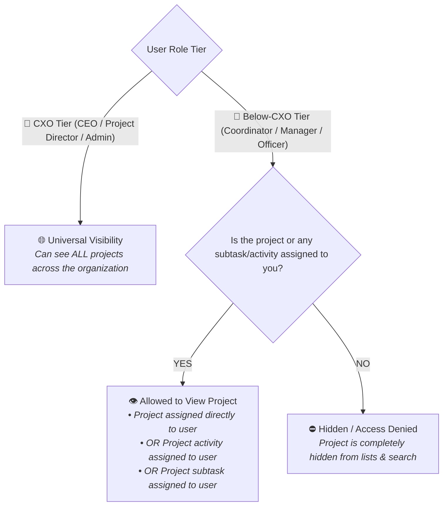

* **👑 CXO Tier (CEO, Project Director, System Manager, Administrator)**: Full cross-organization visibility of all projects.
* **📋 Project Coordinator**: Only sees projects assigned to them under their oversight (`project_coordinator == session.user`) or projects where a subtask is assigned to them.
* **⚙️ Project Manager**: Only sees the project assigned to them (`project_manager == session.user`) or projects where an activity/subtask is assigned to them.
* **🌱 Field Officer**: Only sees projects where an activity or subtask is assigned to them (`custom_activity_owner == session.user` / linked Employee or `assignee == session.user`). Unrelated projects do not appear in their list.

---

## 🗺️ 2. Project Flow Lifecycle Diagram

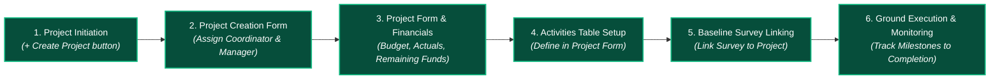

---

## 👤 3. Step-by-Step Journey for Each User Type

---

### 👑 User Journey 1: CXO Tier (CEO / Project Director / Admin)

#### 1. What CXOs See:
* **Project Directory (`/app/kv-project`)**: Sees **every project** in the organization across all thematic areas, coordinators, and managers.
* **`+ Create Project` Action**: Active button in the top action bar.
* **Project Details Form**: Complete edit and delete capabilities. Full visibility into approved budgets, actual amounts spent, and remaining funds across all projects.

#### 2. What CXOs Do:
1. **Initiate Strategic Projects**: Create high-level organizational projects and assign the responsible Project Coordinator and Project Manager.
2. **Budget & Scope Governance**: Reallocate funds, revise timelines, and approve major project phase changes (*Planning* ➔ *Execution* ➔ *Results*).
3. **Cross-Project Reviews**: Monitor aggregated survey submissions and thematic performance metrics across all regional clusters.

---

### 📋 User Journey 2: Project Coordinator (Regional In-Charge & Overseer)

The Project Coordinator oversees a portfolio of projects, ensuring multi-project alignment and supporting Project Managers.

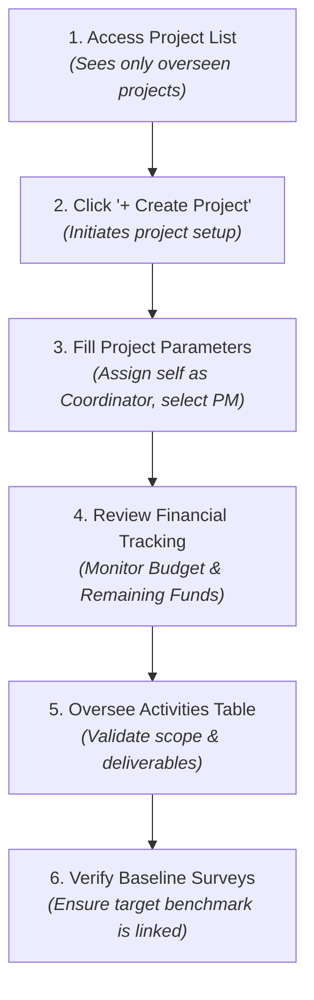

#### Screen 1: Project Initiation (`+ Create Project`) & Visibility Isolation
* **What the Coordinator Sees**: Navigates to `/app/krushi-dashboard` or `/app/kv-project`.
  * The dashboard strictly enforces role isolation: the Coordinator only sees projects assigned to them (e.g. 1 Project), with peer coordinators' projects completely excluded.
  * In the top toolbar, the **`+ Create Project`** button is prominently visible.
* **What the Coordinator Does**: Clicks **`+ Create Project`** to launch a new project initiative for their region.

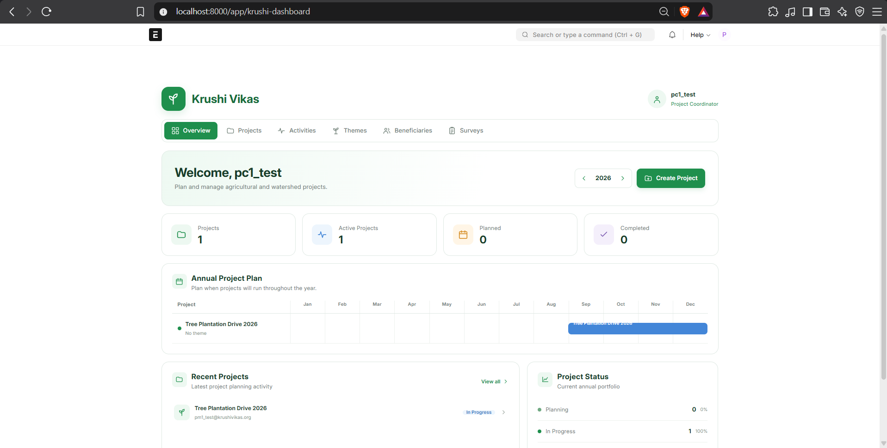
*Figure 1a: Project Coordinator dashboard displaying strict visibility isolation (only assigned project 'Tree Plantation Drive 2026' visible) and '+ Create Project' action.*

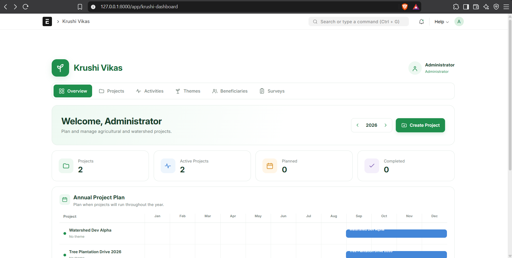
*Figure 1b: Project List view with the '+ Create Project' action button visible to authorized users.*

---

#### Screen 2: Project Creation Form
* **What the Coordinator Sees**: A clean form requiring core project parameters:
  * **Project Name**: Name of the developmental initiative.
  * **Theme**: Thematic area link (e.g., *Sustainable Agriculture*, *Water Harvesting*).
  * **Project Phase** & **Status**: Defaulted to *Execution* / *In Progress*.
  * **Mandatory Project In-Charges**:
    * **`Project Coordinator`**: Pre-filled/selected with their user profile.
    * **`Project Manager`**: Mandatory field to designate the project owner.
  * **Timeline**: Start Date and End Date.
  * **Budget (INR)**: Total sanctioned allocation.
* **What the Coordinator Does**: Enters the project scope, assigns themselves as the supervising **Project Coordinator**, selects the designated **Project Manager**, enters the sanctioned budget, and clicks **Save**.

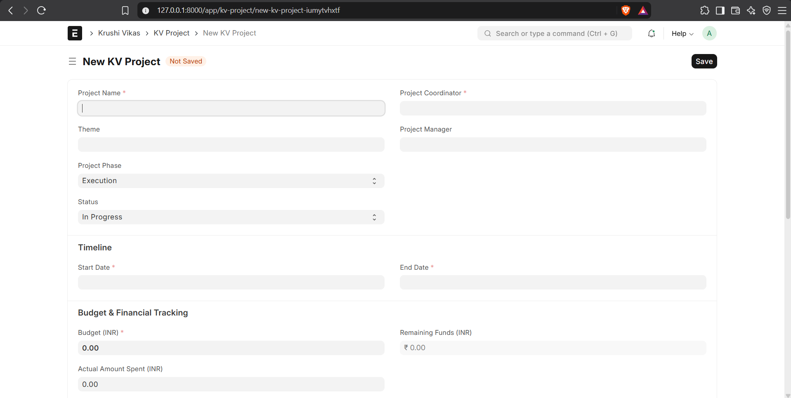
*Figure 2: KV Project Creation Form showing mandatory Project Coordinator & Project Manager selection, timeline, and budget.*

---

#### Screen 3: Project Detail & Financial Monitoring
* **What the Coordinator Sees**:
  * An active project form with dynamic financial cards:
    * **Budget (INR)**: Sanctioned budget.
    * **Actual Amount Spent (INR)**: Total expenditure logged to date.
    * **Remaining Funds (INR)**: Automatically computed (`Budget - Actual Spent`).
  * Action buttons in top header: **`View Activities`**, **`View Tasks`**, and **`Linked Forms`**.
  * If the Coordinator accidentally navigates to a project overseen by a *peer coordinator*, it opens in **Read-Only** mode.
* **What the Coordinator Does**: Reviews financial burn rate, checks whether remaining funds are sufficient for future milestones, and verifies timelines.

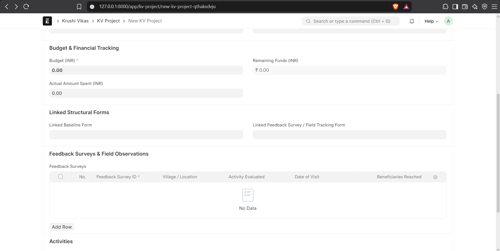
*Figure 3: Project detail form with real-time financial tracking and role assignments.*

---

#### Screen 4: Activities Oversight in Project Form
* **What the Coordinator Sees**: The **Activities Section** table inside the project form showing all planned activities, budget per activity, start/end dates, and assigned owners.
* **What the Coordinator Does**: Evaluates whether the Project Manager has broken down the project appropriately across all quarters.

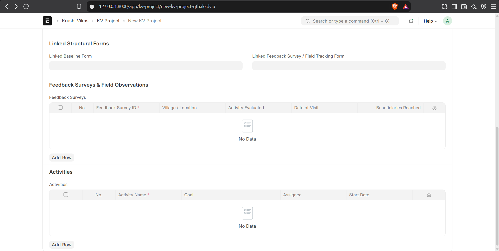
*Figure 4: Activities section in Project Form showing activity breakdown and child table.*

---

#### Screen 5: Linking Baseline Surveys
* **What the Coordinator Sees**: Under **Linked Structural Forms**, the **`Linked Baseline Form`** field.
* **What the Coordinator Does**: Validates that a comprehensive village/household baseline survey is linked to the project before full fund disbursement.

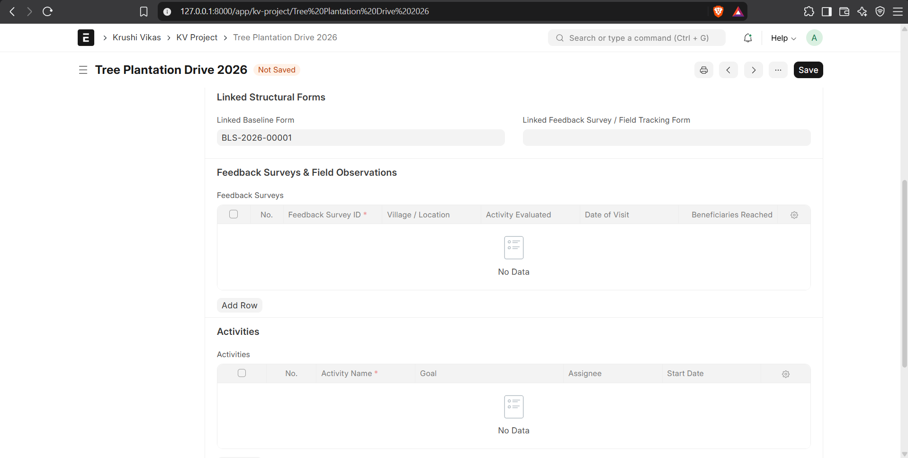
*Figure 5: Linking an existing Baseline Survey to the Project.*

---

### ⚙️ User Journey 3: Project Manager (Direct Project Owner & Operational Lead)

The Project Manager directly owns the project assigned to them, driving day-to-day execution, budgeting, and activity management.

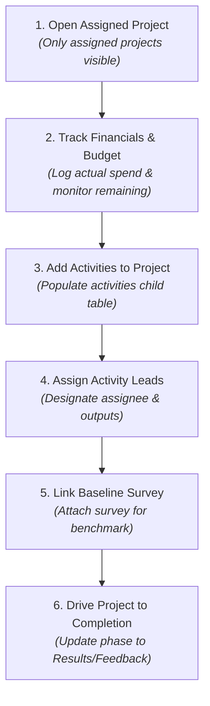

#### Screen 1: Project Dashboard & List View (Focused Visibility)
* **What the Project Manager Sees**: On the Krushi Dashboard and `/app/kv-project`, only the project(s) assigned to them (`project_manager == session.user`) or projects containing subtasks assigned to them appear in the list. Peer managers' projects are completely hidden. The **`+ Create Project`** button is visible.
* **What the Project Manager Does**: Clicks on their project to enter the management workspace.

*Figure 6a: Project Manager dashboard displaying role isolation (only assigned project 'Tree Plantation Drive 2026' visible) and '+ Create Project' action.*

---

#### Screen 2: Financial Management & Budget Utilization (Active Ownership)
* **What the Project Manager Sees**:
  * An active project form with full editing privileges (**Save** button active).
  * Sanctioned **Budget (INR)**, editable **Actual Amount Spent (INR)**, and automatically computed **Remaining Funds (INR)**.
* **What the Project Manager Does**: Inputs actual ground expenditures (equipment, training kits, materials), revises operational fields, and monitors remaining balance to prevent cost overruns.

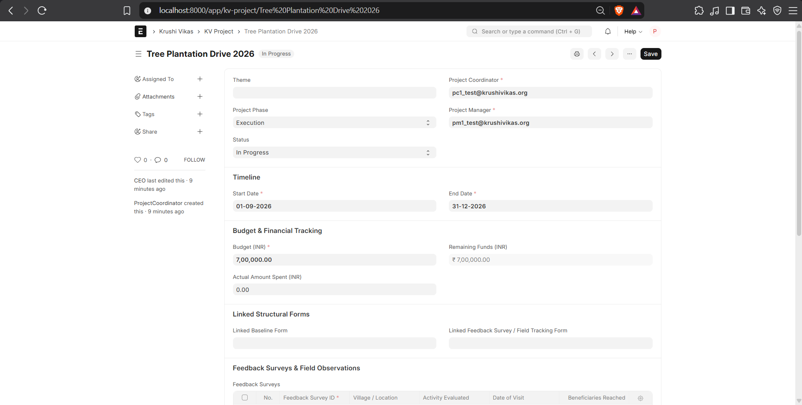
*Figure 6b: Project Form with full edit privileges active for the designated Project Manager.*

---

#### Screen 3: Setting Up Activities in the Project Form
* **What the Project Manager Sees**: The embedded **Activities** child table in the Project Form with the **`Add Row`** button active.
* **What the Project Manager Does**:
  1. Clicks **Add Row** in the Activities table.
  2. Enters the **Activity Name**, **Goal**, **Planned Budget**, **Start Date**, and **End Date**.
  3. Sets the **Assignee** (the Project Manager or designated lead).
  4. Specifies expected **Input/Output** (e.g., *"10 Training Kits"*, *"100% participation"*).
  5. Clicks **Save**. The activity is now part of the project execution plan.

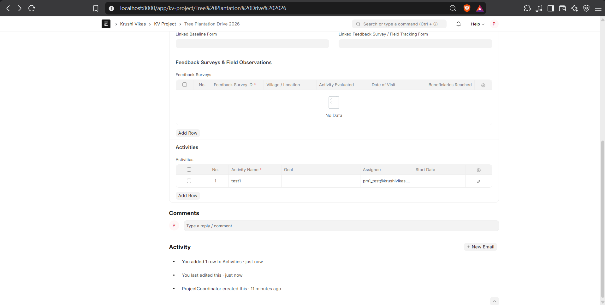
*Figure 6c: Project Manager configuring new operational activities directly within the project form using 'Add Row'.*

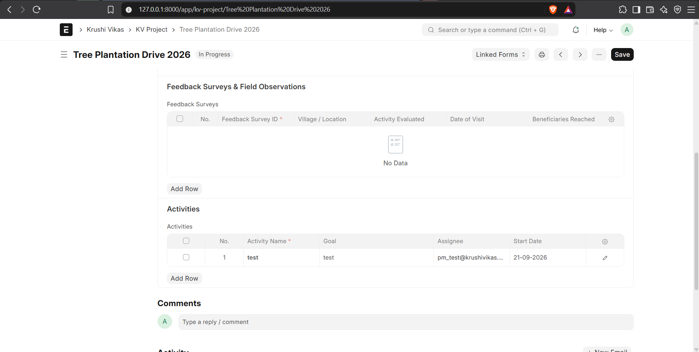
*Figure 6d: Activity row configured and assigned to the Project Manager.*

---

#### Screen 4: Linking Baseline Survey & Structural Forms
* **What the Project Manager Sees**: The **Linked Structural Forms** section on the Project Form.
* **What the Project Manager Does**:
  1. Selects the verified **Baseline Survey** from the dropdown link field.
  2. Clicks **Save**.
  3. Uses the **`Baseline Survey`** button in the top action toolbar (`Linked Forms` menu) to quickly jump to the survey record.

---

### 🌱 User Journey 4: Field Officer (Task Executor & Ground Surveyor)

The Field Officer operates on the ground, interacting with farmers, collecting survey data, and executing assigned subtasks.

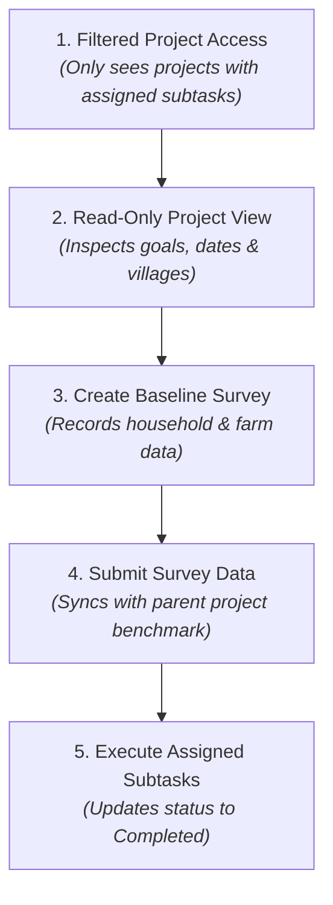

#### Screen 1: Filtered Project Dashboard & List Access (Before & After Task Assignment)
* **What the Field Officer Sees**:
  * **Unassigned State**: When no activities or tasks are assigned to the Field Officer, the dashboard strictly displays **0 Projects**, and the `+ Create Project` button is **hidden** (Field Officers cannot create projects).
  * **Assigned State**: The moment a task (or activity) within *Tree Plantation Drive 2026* is assigned to the Field Officer, the dashboard dynamically surfaces the project card. All unrelated projects remain strictly invisible.
* **What the Field Officer Does**: Selects their assigned project from the dashboard to inspect objectives, target villages, and timelines.

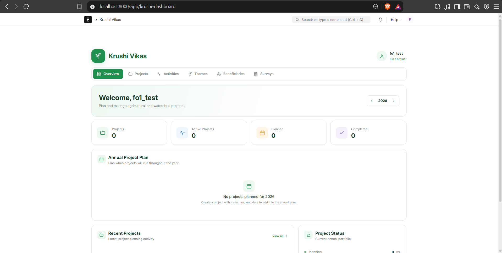
*Figure 7a: Field Officer dashboard in initial unassigned state — showing 0 projects visible and '+ Create Project' action hidden.*

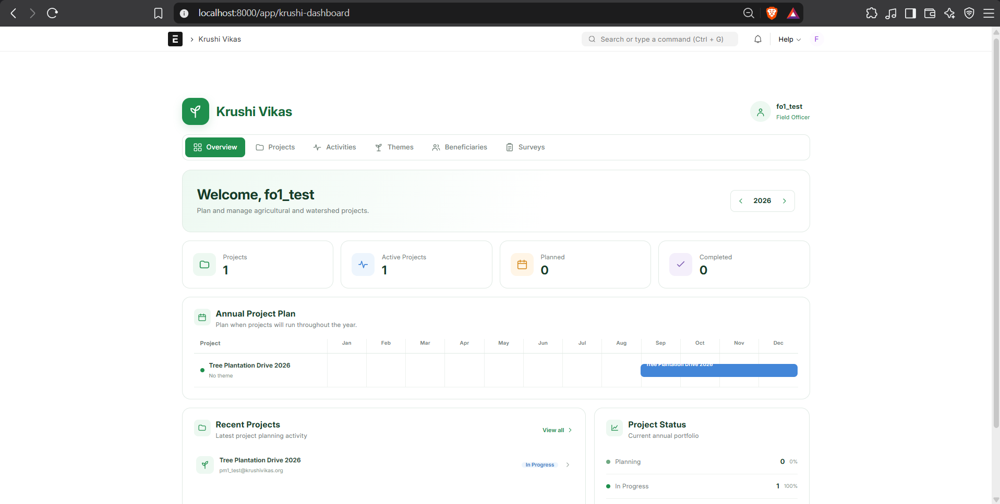
*Figure 7b: Field Officer dashboard dynamically displaying project visibility upon assigned task ownership, with '+ Create Project' action hidden.*

---

#### Screen 2: Project Detail View (Enforced Read-Only Mode)
* **What the Field Officer Sees**:
  * The Project Form opens in **Read-Only** mode.
  * The top **Save** button is completely hidden.
  * All fields (Coordinator, Manager, Timeline, Budget) are greyed out and protected against modification.
* **What the Field Officer Does**: Reviews project parameters and planned activities before going to the field.

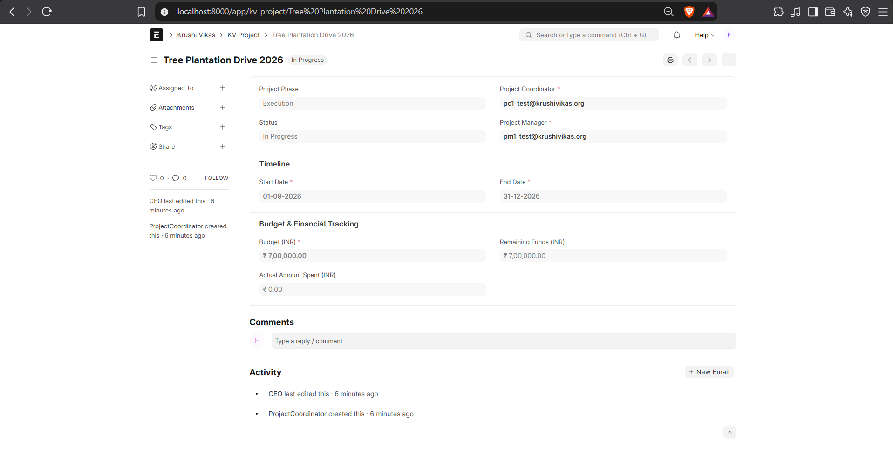
*Figure 7c: Project detail form viewed by Field Officer in enforced Read-Only mode (Save button hidden).*

---

#### Screen 3: Conducting & Submitting Baseline Surveys
* **What the Field Officer Sees**: The **Baseline Survey Creation Form** (`/app/baseline-survey/new` or `/village_profile`).
  * **Farmer Identification**: Farmer Name, Contact, Village, Aadhaar/ID.
  * **Household Demographics**: Family members, annual household income.
  * **Agricultural & Landholding Profile**: Total land, irrigated acreage, water source, current crops.
  * **Benchmark Survey Questions**: Categorized questions regarding farming practices and irrigation methods.
* **What the Field Officer Does**:
  1. Enters field data collected directly from household interviews.
  2. Submits the survey record.
  3. The survey is then available for the Project Manager to link directly to the KV Project.

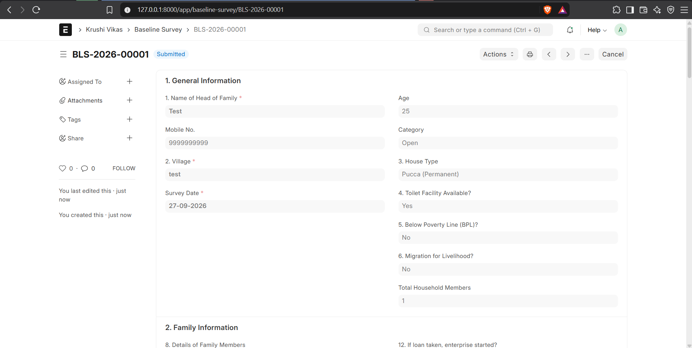
*Figure 7d: Baseline Survey Form for recording household demographics, agricultural profile, and baseline metrics.*

---

#### Screen 4: Field Officer Subtasks Execution & Task Isolation
* **What the Field Officer Sees**:
  * Navigates to the **Task List (`/app/task` or `/tasks`)**.
  * **Strict Task-Level Role Isolation**: The officer **ONLY sees tasks assigned to them** (e.g., `Verify village nursery stock`, `1 of 1`). All peer officers' tasks and unassigned tasks across the organization remain completely hidden.
* **What the Field Officer Does**:
  1. Opens their assigned task from the Task List.
  2. Updates task progress and marks status as *Completed* upon field verification.

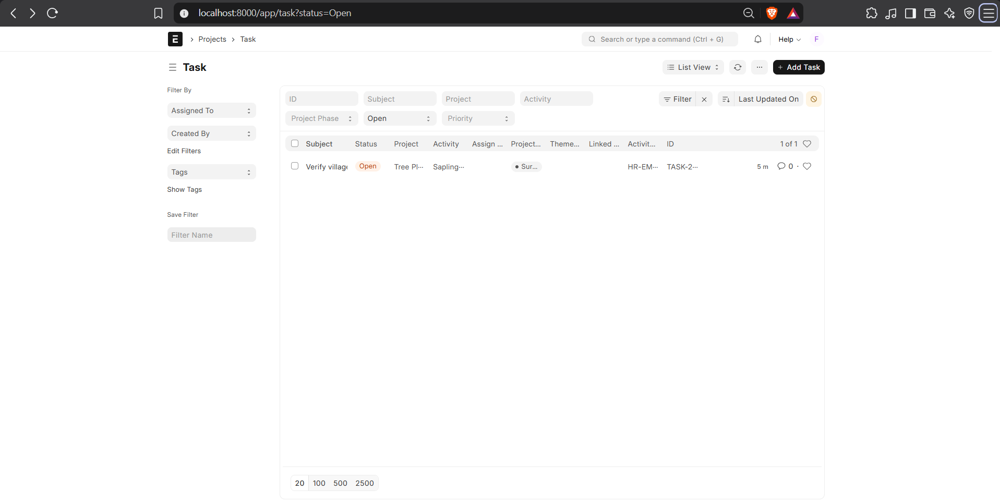
*Figure 8: Task List view showing strict role isolation where Field Officer FO1 can only see their designated assigned task (1 of 1).*

---

## 📊 4. Comparative Matrix: What Each User Sees & Does

| Project Screen / Action | 👑 CXO Tier | 📋 Project Coordinator | ⚙️ Project Manager | 🌱 Field Officer |
| :--- | :--- | :--- | :--- | :--- |
| **`+ Create Project` Action** *(Fig. 1b, 6a)* | ✅ Visible & Active | ✅ Visible & Active | ✅ Visible & Active | ⛔ Hidden *(Fig. 7a, 7b)* |
| **Project Creation Form** *(Fig. 2)* | Create any project; assign Coordinator & PM | Create project; assign self as Coordinator & select PM | Create project; assign self as PM & select Coordinator | ⛔ Access Denied |
| **Project Dashboard / List View** *(Fig. 1a, 6a, 7a, 7b)* | All org projects visible | Only overseen projects or projects with subtasks | Only assigned projects or projects with subtasks | Only projects with assigned subtasks/activities *(Fig. 7a, 7b)* |
| **Project Detail & Financials** *(Fig. 3, 6b, 7c)* | Edit / Delete any project across org | Edit all overseen projects (Peer projects read-only) | Edit assigned project; log actual spend & track remaining funds | 👁️ Read-Only access (Save hidden) *(Fig. 7c)* |
| **Project Activities Table** *(Fig. 4, 6c, 6d)* | Full edit on any project's activities | Review & edit activities under overseen projects | Add activity rows, set planned budgets & assign leads | 👁️ Read-Only view of activity list |
| **Task Ownership & Execution** *(Fig. 8)* | Oversee all organization tasks | Oversee tasks in coordinated projects | Manage & assign tasks under activities | See & edit ONLY their assigned tasks *(Fig. 8)* |
| **Baseline Survey Linking** *(Fig. 5)* | Link or unlink any survey | Review & validate linked survey | Link approved baseline survey to the project | 👁️ Read-Only on project link |
| **Baseline Survey Creation** *(Fig. 7d)* | View all survey submissions | Review surveys in regional cluster | Review surveys in assigned project | Fill out & submit surveys during field visits *(Fig. 7d)* |

---

## 📁 5. Complete Screenshot Asset Mapping

| Screenshot File | Caption / Document Context | Primary Role | Figure |
| :--- | :--- | :--- | :--- |
| `images/pc1_test-can-only-see-his-own-projects.png` | Project Coordinator dashboard showing strict role isolation (1 assigned project) and `+ Create Project` | Project Coordinator | **Figure 1a** |
| `images/create-project-button.png` | Project List view showing the `+ Create Project` button in top toolbar | PC / PM / CXO | **Figure 1b** |
| `images/project-creation-form.png` | Project creation form with mandatory Coordinator, Manager, and Budget | Project Coordinator / PM | **Figure 2** |
| `images/project-detail-financial-form.png` | Active project form displaying Budget, Actual Spent, and Remaining Funds | PM / Coordinator | **Figure 3** |
| `images/project-form-activities-section.png` | Activities section in the project form with child table and Add Row action | PM / Coordinator | **Figure 4** |
| `images/add-baseline-survey-to-project.png` | Attaching the approved Baseline Survey to the Project under Linked Forms | PM / Coordinator | **Figure 5** |
| `images/pm1-can-only-see-the-project-assigned-to-him.png` | Project Manager dashboard displaying strict role isolation (1 assigned project) and `+ Create Project` | Project Manager | **Figure 6a** |
| `images/pm1-can-edit-project-assigned-to-him.png` | Project Form with full edit privileges and active Save button for assigned PM | Project Manager | **Figure 6b** |
| `images/pm1-will-be-able-to-create-new-activities-under-their-project.png` | Project Manager configuring new operational activities directly within project form using 'Add Row' | Project Manager | **Figure 6c** |
| `images/activity-added-in-project-form-and-assigned-to-pm_test.png` | Activity row configured and assigned to the Project Manager | Project Manager | **Figure 6d** |
| `images/fo1-cannot-see-projects-on-dashboard.png` | Field Officer dashboard in initial unassigned state (0 projects visible, Create Project hidden) | Field Officer | **Figure 7a** |
| `images/fo1_test-can-view-the-project-because-he-owns-a-task.png` | Field Officer dashboard dynamically displaying project visibility upon assigned task ownership | Field Officer | **Figure 7b** |
| `images/fo1-can-only-see-the-project-in-read-only-mode.png` | Project detail form viewed by Field Officer in enforced Read-Only mode (Save button hidden) | Field Officer | **Figure 7c** |
| `images/create-baseline-survey-form.png` | Baseline survey form for recording village and household farmer data | Field Officer | **Figure 7d** |
| `images/fo1-can-only-see-the-task-assigned-to-them.png` | Task List view showing strict role isolation where Field Officer FO1 can only see their assigned task (1 of 1) | Field Officer | **Figure 8** |

